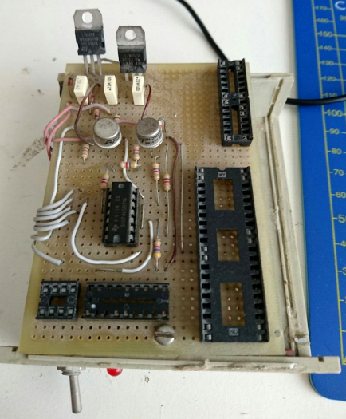
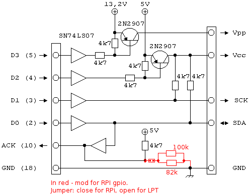
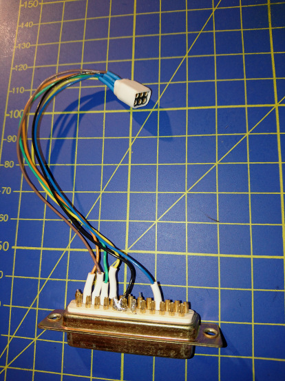
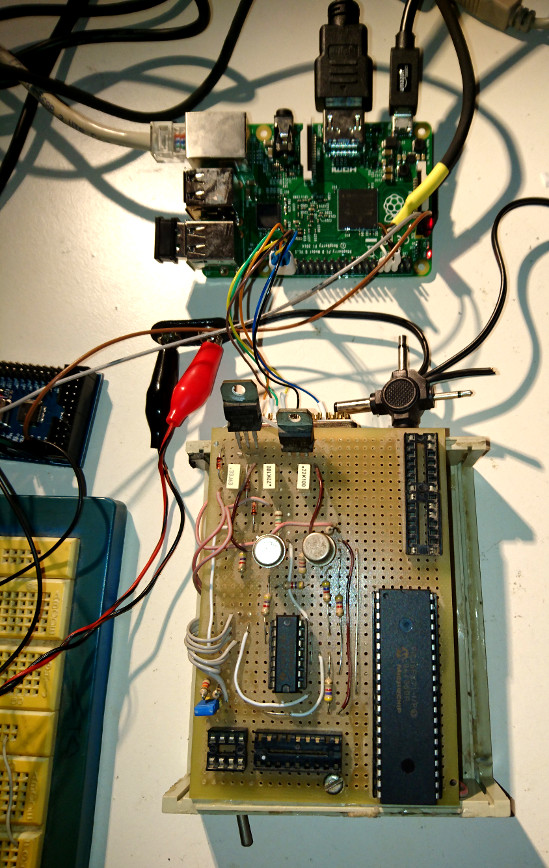

The PIC revenge
======================

Intro
------
So, long time was past since last time I hacked with a PIC microcontroller on my own
(despite I use some dsPIC on my job, but this is another story).

I started to moving toward ARM stuff (both MCU and Linux SoC) and other stuff, my new
PC has not a parallel port for programming PICs, and IIRC the last time I tried to compile
the IDE I used to develop on PICs on my Linux box, it failed, because the SW went
unmaintained.

My PIC drawer and my old parallel programmer started collecting dust.. Until now :)

Recently happened that a friend of mine, an excellent programmer, but a novice in
electronic, started to hack with his new RPi2, and started to get interested in MCUs
as well.

This revived my interest in my old PIC microcontrollers, and I had to find a way to
use them on a recent PC/SW, so that I could also make my friend able to experiment with
them. Also, of course, I wanted to go with only FOSS :)

This repo contains a collection of SW tools, documentation, and schematics that makes
you able to compile a PIC bare-metal application and flash it on a real device.

Software
--------

The first thing I was worried about has been how to flash a PIC device.

After googling around I found "k8048" project, from Darron Broad.
[This is a link to the original site] (http://dev.kewl.org/k8048/Doc/)

After hacking a bit with it (you can find all this stuff in past git history),
I noticed that it changed name and place; the new one is called "pickle",
also from Darron Broad. So I switched to this now one.
[This is a link to the original site] (http://wiki.kewl.org/dokuwiki/projects:pickle)

It's a nice, Open Source, SW capable of programming a wide range of PICs microcontrollers
by using, among other things, the RPi as programmer, exploiting some GPIOs!

There are various PIC devices, certain could be programmed directly with the 3.3V GPIOs,
other requires 5V signals and a high voltage (up to 13V) Vpp supply.

Since most (if not all) PICs in my drawer required 5V programming, and I had my old
programmer already done, with proper socket for my PICs already
soldered, and voltage shifting circuit, I decided to adapted this old parallel programmer
to be driven by my RPi2 :)

In this repo you can find, amond other things, a mirror of latest stable version of pickle, schematic for my HW programmer, and various scripts and misc stuff by me.

The dotfiles directory contains my config file for pickle, that is suitable for
usage on RPi2, with my HW programmer (see the next chapter for details).

I also moved the default GPIO used in the original configuration sample file, so
that they do not collide with the RPi serial port (that I use as tty).

In the script directory you can find a script to setup GPIO before powering up the
programmer (so that input are inputs, output are outputs, VPP control is switched off)
as well as a script to manually turn on and off VCC (that is, my custom HW programmer
can switch on/off VPP and VCC as well, but the latter is not supported by pickle, so
you have to switch it on manually after running pickle, and to switch it off before
removing the PIC from the socket).

Now that I could program a PIC, of course, I need the toolchain.

The GNU gputils project contains an assembler and linker for pic devices. It supports
a wide range of PIC devices and seems to be pretty common, mature and tested. So, I added
a snapshot of the latest version to my repo.

There is also a simulator (gpsim) but I have bot tried it yet.

Since programming in ASM is a little overkilling, I needed a C compiler.
After searching on google it turned out that SDCC should be able to cross-compile for
PIC16 and PIC18 device family. It relies on gputils.
I added a git submodule to the latest stable version.

I tried to use also more recent versions of SDCC (6f53db86cd1d9a6adfbc41c78de61489a00b4760), but I had to hack with aclocal to successfully compile it.

Basically it complained because it tried to explicitly run aclocal-1.15 (while I have 1.14), but updating it resulted in an another, earlier error.

The workaround that worked for me is to keep the "aclocal" 1.14 binary, while providing *also* the "aclocal-1.15" binary. I have no idea of what is going on...

BTW While compiling demo code, the hash of the resulting HEX were different, but both
worked.

Finally I wanted few simple already-made examples to test the whole thing.
I found a git repo with few examples for both PIC16 and PIC18 devices; they was made
for SDCC, so I added another git submodule :)

With this SW collection, you should be covered on all the workflow, from C to HW :)

Hardware
--------

So, I resumed my old hardware programmer, I removed some dust from it, and I
checked its conditions..



The hardware programmer was done as per a schematic found over the internet years ago.



The original schematic is in black, while the red stuff has been added for the RPi.
Basically the two transistors act as switches to enable/disable the VCC and VPP,
while the IC SN74LS07 is a Open Collector buffer.

I checked on the datasheet of the SN74LS07 whether the 3.3V signals from the RPi were
sufficient to drive it, and it turned out that 2V is the recommended minimum high
level, so it's fine for the RPi.

The open-collector logic and the pullup resistors to VCC make sure that
the PIC is programmed with proper voltage (5V) even if the RPi has 3.3V outputs.

The only problem was about the logic level of the data from the programmer to the
RPi, that has 5V high level. I don't know if the RPi inputs are 5V tolerant, I
think they aren't, and I wanted to go safe, so I decided to modify the circuit.

**NOTE: this means that you will probably FRY you RPi** without the resistor and if you forget
to close the jumper.

As you can see, in red, I have added a couple of resistors to lower the 5V signal
to about 3.3V. Maybe there are better solutions, but this was something that I
could readily made with spare parts I had at home :)

The jumper purpose is to eventually disable the resistors if I want to switch back
to 5V signals.

In my programmer I used a 7812 regulator to obtain the 13V supply (that is the needed Vpp
for my PICs) from an external supply, and a 7805 to obtain the +5V from the +13V rail.

In order to make the 7812 to ouput about 13V I put a couple of diodes in series to its GND pin. The external power supply is something around 18V.

You can omit (short) the diodes to achieve 12V or change the 7812 with a 7809 to
achieve 9V, depending by your needs. A LM317, with proper resistors, and a couple of
jumpers, could be a better choice to obtain configurable Vpp.

I have also two leds on the front panel (they are not visible in the pictures) to monitor
the VCC (+5V) and VPP (+13V) states.

Finally I build a simple cable to connect the RPi GPIOs to the DB-25 connector of
my old parallel programmer.



Here is the diagram for the RPi pin I choose

```
                                                     vcc  do  vpp
                                                 gnd g16  g20 g21
+----------------------------------------------------------------+
| 02 04 06 08 10 12 14 16 18 20 22 24 26 28 30 32 34  36  38  40 |
| 01 03 05 07 09 11 13 15 17 19 21 23 25 27 29 31 33  35  37  39 |
+----------------------------------------------------------------+
                                                      g19 g26 gnd
                                                      di  clk
```

The cable wiring diagram is
```
DB25 RPi function
2    38  DO
3    37  CLK
4    26  VCC
5    40  VDD
10   35  DI
18   29  GND
```
NOTE: VCC and VPP are actually VCC nEnable and VPP nEnable control signals.

And finally..
-------------

I connected all the things together, I put a PIC on the programmer socket and
I powered up the thing.

No smoke, that's a good indication :)



You can see other wires on the RPi; those are the serial cable (for tty), and
a reset cable, connected to a little ARM board, that you can spot on the left. I use it
to remotely reset the RPi when I hack with the RPi kernel and I'm not at home
(usually the girl house). The ARM board runs my UAKEH project and controls also
other stuff, but it's OT here :P

Finally I run pickle, and...

This is the first success log, of my setup correctly identifying a PIC16F871 :) :)

```
pi@raspberrypi:~$ p14 id
[0000] [PROGRAM]  0800 WORDS
[2000] [USERID0]  3FFF .
[2001] [USERID1]  3FFF .
[2002] [USERID2]  3FFF .
[2003] [USERID3]  3FFF .
[2004] [RESERVED] 3FFF
[2005] [RESERVED] 3FFF
[2006] [DEVICEID] 0D21 DEV:D20 REV:01 PIC16F871
[2007] [CONFIG]   3F7B
[2100] [DATA]     0040 BYTES
```